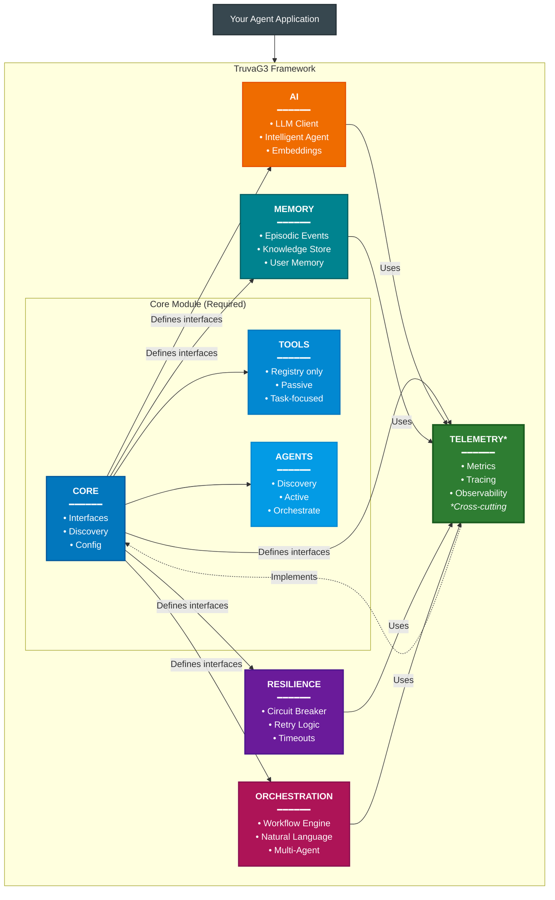
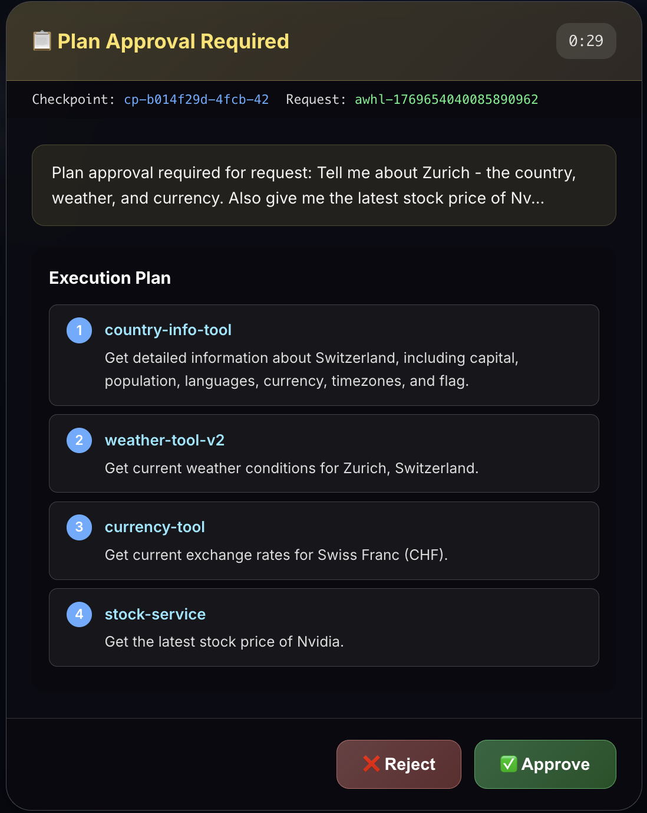
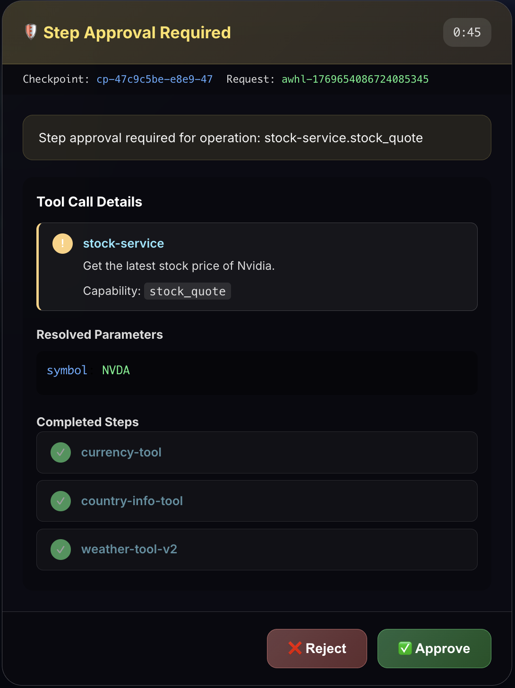
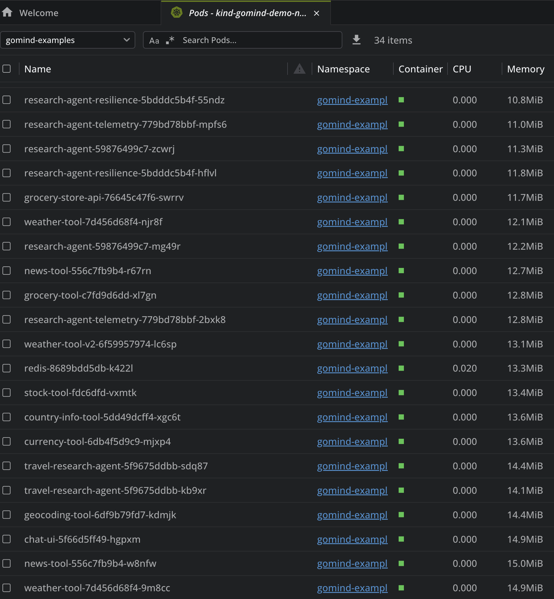

# TruvaG3 - Kubernetes-Native AI Agent Framework for Enterprise Environments

[](https://golang.org/dl/)
[](LICENSE)

> **Microservices meet AI**: Build and operate agent ecosystems as independent Kubernetes services — discover capabilities dynamically, orchestrate intelligently, and keep the whole system inside your own platform boundaries.

> **Note:** TruvaG3 is an open-source framework and reference implementation for teams exploring or building enterprise agent platforms. It demonstrates production-oriented patterns built on open standards and open-source tools, with a "batteries-included, fully replaceable" philosophy — sensible defaults sit behind interfaces at every layer, so developers can swap not just backends (service discovery, LLM provider, telemetry, memory store) but also the framework's own behaviour (prompt construction, planning, retry and error handling, pipeline hooks for background jobs and cross-cutting middleware).

TruvaG3 is an **open source** framework for building autonomous AI agent networks, inspired by **microservice architecture** principles. It is especially well-suited for enterprises that want to run agentic systems inside their existing Kubernetes estate, including air-gapped or tightly controlled environments. Different teams, departments, and use cases can run isolated agent ecosystems in separate namespaces while still using familiar platform controls around networking, observability, rollout, and security.

**Vendor agnostic by design**: Seamlessly integrate with any LLM provider (OpenAI, Anthropic, Gemini, Groq, DeepSeek) or your own self-hosted models via OpenAI-compatible endpoints. Switch providers without changing your agent code.

**Production-quality patterns**: dynamic capability-based service discovery (Redis/Valkey by default; pluggable behind the `core.Discovery` interface), built-in resilience patterns (circuit breakers, semantic retry, panic recovery), and full observability through OpenTelemetry with distributed tracing and unified metrics. Written in Go for minimal resource footprint (~15-44MB containers, 8-20MB runtime memory) and Kubernetes-native deployment.

**Distinguishing strength**: TruvaG3 is strongest when the requirement is not just "build an agent", but "run many agent systems safely inside enterprise infrastructure." That includes self-hosted operation, namespace isolation, direct in-cluster service communication, and the ability to grow from isolated experiments to large internal fleets of agents and tools without depending on an external SaaS control plane.

## Table of Contents

**1. Quick Start**
- [Why TruvaG3?](#why-truvag3-microservices-architecture-for-ai-agents) • *2 min read*
- [Getting Started in 5 Minutes](#getting-started-in-5-minutes) • *5 min setup*
- [Installation](#installation) • *30 seconds*

**2. Core Concepts**
- [What Makes TruvaG3 Unique](#what-makes-truvag3-unique-dynamic-agent-discovery-vendor-agnostic-microservice-native-ai) • *Key differentiators*
- [Architecture Overview](#how-truvag3-works) • *5 min read*
- [Enterprise Deployment Model](#enterprise-deployment-model-run-agent-ecosystems-inside-your-existing-kubernetes-platform) • *Why this fits enterprise platforms*
- [Key Features](#core-capabilities)
  - [Dynamic Service Discovery](#1-agents-that-find-each-other-automatically) - Tools & agents find each other at runtime
  - [AI-Powered Orchestration](#2-talk-to-your-agents-in-plain-english) - Natural language → execution plans
  - [Resilience Patterns](#3-agents-that-dont-crash-your-system) - Circuit breakers, retry, panic recovery
  - [Human-in-the-Loop](#4-human-in-the-loop-approval-checkpoints) - Plan & step approval checkpoints
  - [Full Observability](#5-know-what-your-agents-are-doing-without-the-hassle) - Metrics, tracing, logging
  - [Agent Memory](#6-agent-memory) - Cross-agent shared memory + per-user personalization

**3. Guides & Examples**
- [Real-World Example](#putting-it-all-together-a-real-example) • *Complete system*
- [Setup Pattern](#complete-setup-pattern) • *Full deployment*
- [Module Documentation](#module-documentation) • *Reference docs*

**4. Deployment & Performance**
- [Kubernetes Deployment](#deploy-your-agent-to-kubernetes) • *Container setup*
- [Performance Metrics](#container-image-size-details) • *Verified benchmarks*
- [Framework Comparison](#quick-framework-comparison) • *vs Python alternatives*

**5. When to Use TruvaG3**
- [Choose TruvaG3](#when-to-use-truvag3) • *Is it right for you?*
- [Microservices for AI](#why-truvag3-microservices-architecture-for-ai-agents) • *For architects*
- [Limitations](#consider-other-options-if) • *Be informed*

**6. Resources**
- [Examples Repository](#examples) • *Working code*
- [Troubleshooting](#next-steps) • *Common issues*
- [Contributing](#contributing) • *Join the project*

---

**Reading Paths:**
- **Quick Evaluation** (5 mins): What is TruvaG3? → When to Use TruvaG3?
- **Developer Onboarding** (15 mins): Getting Started → Key Features → Examples
- **Architecture Review** (30 mins): Architecture Overview → Setup Pattern → Framework Comparison
- **Complete Guide** (60 mins): Read everything top to bottom

---

## Why TruvaG3? Microservices Architecture for AI Agents

### 1. The Microservices Paradigm Applied to AI

**The Core Insight**: The same principles that revolutionized web services—independent deployment, service discovery, fault isolation, and horizontal scaling—apply perfectly to AI agent systems.

Just as microservices decomposed monolithic applications into specialized, independently deployable services, TruvaG3 decomposes AI systems into:

- **Tools as Domain Services**: Each tool is an independent microservice focused on a specific domain, exposing multiple related capabilities. A stock-market-tool provides quotes, company profiles, and news; a weather-tool provides current conditions and forecasts. Deploy, scale, and update each domain independently.
- **Agents as Composable Orchestrators**: Agents discover and coordinate tools at runtime—but they also expose their own capabilities. A travel-research agent orchestrates weather, currency, and geocoding tools, then exposes `research_destination` as a capability that other agents can call. This enables hierarchical composition: agents calling agents.
- **Dynamic Discovery**: Both tools and agents register their capabilities; any agent can discover and use them. Add new tools or agents without redeploying existing ones.
- **Fault Isolation**: One tool failing doesn't crash your AI system. Circuit breakers prevent cascade failures.
- **Independent Scaling**: Scale only the tools under load. A popular weather tool can run 10 replicas while a rarely-used calculator runs one.
- **Zero-Downtime Updates**: Rolling deployments for individual tools. Agents discover new versions as they come online.

### 2. Kubernetes-Native: Built for the Platform That Runs Production

**Why Reinvent the Wheel?** Kubernetes already solved the hard problems of running microservices at scale. TruvaG3 embraces this foundation, adding AI-specific capabilities on top:

| Capability | Kubernetes Provides | TruvaG3 Adds |
|------------|---------------------|-------------|
| **Discovery** | Service DNS for static endpoints | Dynamic capability discovery (Redis/Valkey by default; pluggable) — agents find tools by what they do, not where they are |
| **Auto-scaling** | HPA scales pods based on metrics | Go's 8-20MB memory footprint can increase pod density compared with heavier interpreter-based stacks |
| **Health Monitoring** | Restart failed pods | Circuit breakers prevent cascade failures before pods need restarting |
| **Load Balancing** | Distribute traffic across replicas | Intelligent routing based on tool capabilities and health status |
| **Rolling Updates** | Zero-downtime deployments | Agents automatically discover new tool versions as they come online |

**The TruvaG3 Advantage**: Go's tiny containers (~15-44MB) and minimal runtime footprint (8-20MB) make aggressive autoscaling practical. Scale from 10 to 100 agents without blowing your infrastructure budget.

### 2.5 Enterprise Deployment Model: Run Agent Ecosystems Inside Your Existing Kubernetes Platform

Many enterprises do not want a separate hosted agent control plane. They want agent systems to live inside the same operational model they already trust.

That is where TruvaG3 is intentionally different:

- **Self-hosted by default**: agents, tools, discovery, traces, and runtime data stay in your environment
- **Air-gapped friendly**: works in restricted environments where external SaaS dependencies are not acceptable
- **Namespace-oriented isolation**: teams, departments, and business domains can run separate agent ecosystems with clear boundaries
- **Direct use of Kubernetes primitives**: Deployments, Services, Ingress, NetworkPolicy, Secrets, autoscaling, and standard cluster observability all fit naturally
- **Platform-team friendly**: no need to replace your existing Kubernetes operating model to run agent workloads

This makes TruvaG3 a strong fit for enterprises that want to support:

- multiple internal agent programs in parallel
- different compliance zones or data boundaries
- separate non-prod and prod agent environments
- gradual growth from experiments to hundreds of agents and tools

### 3. Why Go? Language Is No Longer a Barrier

**The AI-Assisted Coding Revolution**: With GitHub Copilot, Claude Code, and Cursor, programming language syntax is no longer a barrier. If you understand programming concepts, AI assistants help you write idiomatic code in any language.

**So Why Choose Go for AI Tools and Agents?**

| What You Get with Go | The Reality |
|---------------------|-------------|
| **Container Size** | ~15-26MB for tools, ~24-44MB for agents (verified) |
| **Memory Footprint** | 8-20MB at runtime (verified in Kubernetes) |
| **Startup Time** | ~100ms |
| **Deployment** | Single binary - no dependencies |
| **Concurrency** | Native goroutines - thousands of concurrent operations |
| **Kubernetes Native** | Built-in health checks, Service DNS support |

**The Bottom Line**: With AI assistance removing the learning curve, Go gives you real advantages for agent infrastructure. You write agents that are faster, smaller, and more reliable.

### 4. Patterns TruvaG3 Demonstrates

TruvaG3 addresses common challenges in building AI agent systems. Study these patterns and adapt them for your own needs:

### Challenges & Solutions

🔴 **Common Challenge**: "Here's how to build an agent. Good luck running 100 of them in production!"
✅ **TruvaG3 shows**: Tools and agents with built-in resilience patterns. Components stay up even when external APIs go down.

🔴 **Common Challenge**: "Install these 50 dependencies, hope they don't conflict."
✅ **TruvaG3 shows**: Single binary deployment. No dependency hell.

🔴 **Common Challenge**: "To coordinate components, write complex orchestration code."
✅ **TruvaG3 shows**: AI dynamically generates execution plans from natural language. LLM analyzes your request, discovers available tools, and orchestrates them intelligently.

🔴 **Common Challenge**: "When API calls fail, I need to manually handle retries and error correction."
✅ **TruvaG3 shows**: **Semantic Retry** automatically computes corrected parameters using LLM analysis. When `amount: 0` fails, it computes `amount: 46828.5` from source data.

🔴 **Common Challenge**: "Add Prometheus, OpenTelemetry, Grafana, configure them all..."
✅ **TruvaG3 shows**: Initialize once, then `telemetry.Counter("task.done")`. Observability built-in.

## What Makes TruvaG3 Unique: Dynamic Agent Discovery, Vendor-Agnostic, Microservice-Native AI

While many popular frameworks center orchestration around explicit graphs, predefined roles, or conversation patterns, TruvaG3 takes a different approach: **dynamic capability-based discovery** where agents discover tools and other agents at runtime through a pluggable service registry (Redis/Valkey by default) — combined with **vendor-agnostic AI** that works with any LLM provider.

For architects, the practical differentiators are:

- **Agents and tools are ordinary services**: independently deployable, observable, and owned like any other platform workload
- **Discovery is capability-based, not just endpoint-based**: agents find what other services can do, not only where they are
- **Namespace isolation works with the architecture**: teams can run their own agent/tool ecosystems without flattening everything into one global control plane
- **No mandatory SaaS dependency**: a major advantage for regulated, internal, or air-gapped deployments
- **Direct service-to-service runtime**: once discovered, agents and tools communicate through normal in-cluster HTTP, which is easy for engineers and ops teams to reason about
- **Security aligns with existing K8s REST service models**: because agents and tools are ordinary HTTP services, teams that already secure REST microservices in Kubernetes can reuse the same ingress, gateway, mesh, mTLS, OAuth/JWT, header propagation, and network policy patterns instead of adopting a separate agent-specific security stack
- **Observability fits existing OTEL and Kubernetes operations**: TruvaG3 emits OpenTelemetry-native traces and metrics, carries trace context across agents and tools, and produces structured logs that are collected and correlated through the OTEL Collector and Loki/Jaeger stack, so platform teams can troubleshoot distributed agent workflows using the same Grafana, Jaeger, Prometheus, and collector patterns they already know
- **Well aligned with existing enterprise platform controls**: Kubernetes networking, rollout strategies, service DNS, logs, traces, metrics, and secrets management all remain first-class

> **A note on terminology**: TruvaG3 "Tools" are **not** the same as MCP (Model Context Protocol) tools. An MCP **tool** is a single named function exposed by an MCP **server** for a client/LLM to invoke. A TruvaG3 **Tool** is an independent microservice — it runs in its own container, registers itself with the framework's pluggable service registry, and exposes one or more **capabilities** over HTTP. The cleaner mapping is: a TruvaG3 Tool plays the role of an MCP server, and a TruvaG3 capability plays the role of an MCP tool.

### Dynamic Orchestration Over Predefined Workflows

**Many Frameworks Commonly Emphasize:**
- Workflows defined in code: chains, graphs, crews, or conversation patterns
- Agent roles and responsibilities that are often modeled explicitly
- More upfront orchestration structure when adding new capabilities
- Tool selection that is commonly declared in code or configuration

**TruvaG3's Approach:**
- AI generates execution plans at runtime based on natural language requests
- Tools register themselves with capabilities - no predefined roles needed
- New tools automatically become available to existing orchestrators via the service registry
- LLM dynamically selects tools based on discovered capabilities, not hardcoded references

### True Vendor Independence

Switch LLM providers without changing your agent code:

```go
// Same agent code works with any provider
client, _ := ai.NewClient(ai.WithProviderAlias("openai")) // or omit options and rely on env auto-detection

// Or explicitly choose providers at runtime
openai, _ := ai.NewClient(ai.WithProviderAlias("openai"))
anthropic, _ := ai.NewClient(ai.WithProviderAlias("anthropic"))
selfHosted, _ := ai.NewClient(ai.WithProviderAlias("openai.ollama")) // Your own models
```

Supported providers: OpenAI, Anthropic Claude, Google Gemini, Groq, DeepSeek, Ollama, and any OpenAI-compatible endpoint (vLLM, LocalAI, etc.).

### Architectural Innovation: Compile-Time Enforcement

TruvaG3 uniquely enforces architectural boundaries at compile time through Go interfaces:

```go
// Tools can ONLY register themselves (passive components)
type Registry interface {
    Register(ctx context.Context, info *ServiceInfo) error
    UpdateHealth(ctx context.Context, id string, status HealthStatus) error
    Unregister(ctx context.Context, id string) error
    // No discovery methods - tools cannot find other components
}

// Agents can BOTH register AND discover (active orchestrators)
type Discovery interface {
    Registry  // Embeds registration capability
    Discover(ctx context.Context, filter DiscoveryFilter) ([]*ServiceInfo, error)
    FindService(ctx context.Context, serviceName string) ([]*ServiceInfo, error)
    FindByCapability(ctx context.Context, capability string) ([]*ServiceInfo, error)
}
```

This isn't just a convention - it's enforced by the type system. Tools literally cannot access discovery methods, preventing architectural violations before your code even runs.

### Production-Quality Patterns

TruvaG3 implements the same patterns used in production-grade systems, giving you a working reference to learn from:

| Aspect | TruvaG3 | Traditional Frameworks |
|--------|--------|----------------------|
| **Container Size** | 15-44MB (verified) | Depends heavily on base image and dependencies |
| **Memory per Agent** | 8-20MB (verified in K8s) | Varies with runtime, libraries, and workload |
| **Startup Time** | ~100ms | Usually slower with interpreter and dependency initialization |
| **Concurrent Agents** | 1000s (goroutines) | Depends on runtime model and deployment architecture |
| **Health Checks** | Built-in from start | Added via extensions |
| **Circuit Breakers** | Native support | External libraries needed |
| **Service Discovery** | Capability-based, automatic (Redis/Valkey default) | Manual configuration |
| **Semantic Retry** | LLM computes corrected params | Manual error handling |
| **Human-in-the-Loop** | Built-in approval checkpoints | Custom implementation |

### 🎬 See It In Action: Dynamic Tool Selection

These are **real responses** from agents running in Kubernetes right now. Watch how the same agent automatically selects different tools based on your question:

**Query 1: "weather in Paris"** → Agent selects `weather-service`
```json
{
  "topic": "weather in Paris",
  "tools_used": ["weather-service"],
  "results": [{
    "tool_name": "weather-service",
    "capability": "current_weather",
    "data": {
      "location": "Paris",
      "temperature": 9.73,
      "condition": "broken clouds",
      "humidity": 88
    }
  }],
  "metadata": { "tools_discovered": 8, "tools_used": 1 }
}
```

**Query 2: "stock price of Apple"** → Agent selects `stock-service`
```json
{
  "topic": "stock price of Apple",
  "tools_used": ["stock-service"],
  "results": [{
    "tool_name": "stock-service",
    "capability": "stock_quote",
    "data": {
      "symbol": "AAPL",
      "current_price": 274.61,
      "change": 0.5,
      "percent_change": 0.1824
    }
  }]
}
```

**Query 3: "capital of Japan"** → Agent selects `country-info-tool`
```json
{
  "topic": "what is the capital of Japan",
  "tools_used": ["country-info-tool"],
  "results": [{
    "tool_name": "country-info-tool",
    "capability": "get_country_info",
    "data": {
      "name": "Japan",
      "capital": "Tokyo",
      "population": 123210000,
      "currency": { "code": "JPY", "symbol": "¥" }
    }
  }]
}
```

**The agent discovered 8 tools and intelligently selected the right one for each query - no hardcoded routing!**

→ Run these yourself: `curl -X POST localhost:8092/api/capabilities/research_topic -d '{"topic":"weather in Paris"}'`

→ See [examples/agent-with-telemetry](examples/agent-with-telemetry/) for the full implementation

---

### 🔗 Multi-Tool Orchestration: Natural Language Coordination

For complex queries, the orchestration agent coordinates **multiple tools automatically**:

**Query: "What is the weather like in Tokyo?"**
```json
{
  "request": "What is the weather like in Tokyo?",
  "tools_used": ["weather-tool-v2", "geocoding-tool"],
  "response": "The current weather in Tokyo, Japan, is characterized by a clear sky,
               with a temperature of approximately 4.2°C. The humidity level is 80%...",
  "confidence": 0.95
}
```

**Query: "Tell me about France - population, currency, and recent news"**
```json
{
  "request": "Tell me about France - population, currency, and any recent news",
  "tools_used": ["news-tool", "country-info-tool"],
  "response": "France has a population of approximately 66.4 million people.
               The currency is the Euro (EUR). Recent news highlights include...",
  "confidence": 0.95
}
```

**Complex Query: Travel planning with stock sale, currency conversion, weather, and news**

```bash
curl -X POST localhost:8094/orchestrate/natural \
  -H "Content-Type: application/json" \
  -d '{
    "request": "I am planning to sell 100 Tesla shares to fund my travel to Seoul for a week. I am travelling from New York. Will I be able to afford it? If so, how much local currency will I have and how much will I need for a moderate expenses? Is there any latest news about Seoul that I need to be aware of? Also, I do not want to travel in cold weather there, so what is the weather right now?",
    "use_ai": true
  }'
```

The AI automatically coordinates **6 tools** and synthesizes a comprehensive response:
```json
{
  "request_id": "1765943192244541511-244541594",
  "request": "I am planning to sell 100 Tesla shares to fund my travel to Seoul for a week...",
  "tools_used": [
    "stock-service", "country-info-tool", "geocoding-tool",
    "weather-service", "currency-tool", "news-tool"
  ],
  "response": "You are planning to sell 100 Tesla shares to fund your travel to Seoul from New York.
    Here's a breakdown of your potential expenses and relevant information for your trip:

    ### Financial Overview:
    1. **Current Tesla Stock Price**: As of now, Tesla's stock is priced at **$489.88**.
       Selling 100 shares would yield: 100 shares × 489.88 USD/share = **48,988 USD**

    2. **Currency Conversion**: The local currency in South Korea is the **South Korean won (₩)**.
       At approximately 1 USD = 1,300 KRW:
       48,988 USD × 1,300 KRW/USD ≈ **63,684,400 KRW**

    ### Travel Expenses:
    For a moderate travel experience in Seoul, expect to spend around **₩100,000 to ₩150,000**
    per day on accommodation, meals, transportation, and activities.
    For a week (7 days): approximately **700,000 KRW to 1,050,000 KRW**

    ### Weather in Seoul:
    Currently, the weather in Seoul is **5.76°C** with haze and humidity of **65%**.
    If you prefer to avoid cold weather, you might find this temperature on the cooler side.

    ### Latest News in Seoul:
    1. **Public Transport Update**: South Korea is enhancing its public transport system
       to allow tourists to use their Visa or Mastercard for easier access across cities
       like Seoul and Busan.
    2. **Social Media Regulations**: There are discussions regarding potential restrictions
       on teenagers' use of social media, which may affect the local digital landscape.

    ### Conclusion:
    Yes, you will be able to afford your trip to Seoul after selling your Tesla shares.
    You should have a substantial amount of local currency for your expenses.
    Be prepared for the cooler weather. Safe travels!",
  "confidence": 0.95,
  "execution_time": "21.7s"
}
```

**The AI understood this complex multi-part question and automatically selected 6 tools - no hardcoded routing!**

→ Try it: `curl -X POST localhost:8094/orchestrate/natural -d '{"request":"your question here","use_ai":true}'`

→ See [examples/agent-with-orchestration](examples/agent-with-orchestration/) for the full implementation

---

### Real-World Example: The Power of Autonomous Discovery

Consider building a multi-agent system. Here's how the approaches differ:

**LangGraph** ([docs](https://docs.langchain.com/oss/python/langgraph/workflows-agents)) - commonly models orchestration with explicit graphs:
```python
from langgraph.graph import StateGraph, START, END

# A typical LangGraph workflow defines nodes and edges explicitly
builder = StateGraph(GraphState)
builder.add_node("data_fetcher", fetch_data)
builder.add_node("analyzer", analyze_data)
builder.add_node("reporter", generate_report)
builder.add_edge(START, "data_fetcher")
builder.add_edge("data_fetcher", "analyzer")
builder.add_edge("analyzer", "reporter")
builder.add_edge("reporter", END)
graph = builder.compile()
```

**CrewAI** ([docs](https://docs.crewai.com/en/concepts/agents)) - commonly models orchestration through explicit roles, tasks, and crews:
```python
from crewai import Agent, Task, Crew

# A typical CrewAI flow defines agent roles and task ownership upfront
fetcher = Agent(role="Data Fetcher", goal="Fetch data from sources", backstory="...")
analyzer = Agent(role="Data Analyst", goal="Analyze the fetched data", backstory="...")
reporter = Agent(role="Reporter", goal="Generate reports", backstory="...")

# Tasks are commonly assigned explicitly to agents
task1 = Task(description="Fetch data", agent=fetcher)
task2 = Task(description="Analyze data", agent=analyzer, context=[task1])
task3 = Task(description="Generate report", agent=reporter, context=[task2])

crew = Crew(agents=[fetcher, analyzer, reporter], tasks=[task1, task2, task3])
```

**AutoGen** ([docs](https://microsoft.github.io/autogen/stable/index.html)) - commonly models orchestration through explicit agent and conversation patterns:
```python
from autogen_agentchat.agents import AssistantAgent
from autogen_agentchat.teams import SelectorGroupChat
from autogen_ext.models.openai import OpenAIChatCompletionClient

# A typical AutoGen setup creates agents and specifies how they interact
model_client = OpenAIChatCompletionClient(model="gpt-4o")
planner = AssistantAgent("planner", model_client=model_client, description="Plan the work")
researcher = AssistantAgent("researcher", model_client=model_client, description="Gather information")
writer = AssistantAgent("writer", model_client=model_client, description="Produce the final answer")

team = SelectorGroupChat(
    [planner, researcher, writer],
    model_client=model_client,
)
result = team.run(task="Analyze the data")
```

**TruvaG3 Approach (AI-Driven Orchestration):**
```go
// Create orchestrator - no explicit tool/agent wiring needed
orchestrator := orchestration.CreateOrchestrator(config, deps)

// Process natural language request
response, _ := orchestrator.ProcessRequest(ctx,
    "What's the weather in Tokyo and convert 1000 USD to JPY?", nil)

// The orchestrator automatically:
//   1. Discovers available tools from Redis (weather-service, currency-tool, etc.)
//   2. AI generates a DAG execution plan based on the request
//   3. Executes steps in parallel/sequential order as needed
//   4. Synthesizes results into a coherent response
```

In TruvaG3's dynamic mode, there is no per-request tool wiring in the application code. Deploy a new tool, and it becomes discoverable to orchestrators immediately.

### Dual-Mode Orchestration: Choose Your Approach

While TruvaG3's strength is autonomous agent networks, it **also provides traditional workflow-based orchestration** for scenarios requiring explicit control. You can choose the right approach for each use case:

**Workflow-Based (Explicit Control):**
```yaml
# Define deterministic workflows in YAML
name: data-pipeline
steps:
  - name: fetch
    agent: data-fetcher
    action: get_data
  - name: analyze
    agent: analyzer
    action: process
    depends_on: [fetch]
  - name: report
    agent: reporter
    action: generate
    depends_on: [analyze]
```

**Autonomous (Dynamic Flexibility):**
```go
// Let AI orchestrate agents based on natural language
orchestrator.ProcessRequest(ctx,
    "Fetch sales data, analyze trends, and generate a report",
    nil,  // AI determines the execution plan dynamically
)
```

**Choosing Your Approach:**
- **Use Workflows** for: Regulated processes, audit requirements, deterministic execution
- **Use Autonomous** for: Exploratory tasks, dynamic scenarios, natural language interfaces
- **Deploy Both** in your system: Different services can use different orchestration modes

Both orchestration modes leverage the same underlying agent discovery infrastructure, ensuring your agents work seamlessly regardless of how they're orchestrated.

## How TruvaG3 Works

### System Architecture - Runtime Behavior in Kubernetes

TruvaG3 is designed for distributed agent systems. Here's how Tools, Agents, and the Registry interact at runtime:


**Key Architectural Rules**:

| Component | Can Register | Can Discover | Role |
|-----------|-------------|--------------|------|
| **Tools** | ✅ Yes | ❌ No | Passive - do ONE thing well, respond to requests |
| **Agents** | ✅ Yes | ✅ Yes | Active - discover tools, orchestrate workflows, use AI |

**Understanding Tools and Agents**:

- **Tools** are like Unix commands (`ls`, `grep`, `sort`) or kitchen appliances - each does ONE thing well. A weather-tool fetches weather, a stock-tool fetches stock prices. Tools are "passive" within TruvaG3 (can't discover other components), but actively call APIs outside the TruvaG3 ecosystem to fulfill their capability - whether that's a public internet API (OpenWeatherMap), an internal service in your cluster (company-data-api), or a database.

- **Agents** are like chefs who use multiple kitchen tools to create a meal. They discover available tools, select the right ones for the task, and orchestrate complex workflows - often using AI to make intelligent decisions. Agents also register their own capabilities and can be discovered by other agents, enabling hierarchical orchestration (e.g., a master-agent delegating to specialized sub-agents).

> **A note on terminology**: TruvaG3 "Tools" are **not** the same as MCP (Model Context Protocol) tools. An MCP **tool** is a single named function exposed by an MCP **server** for a client/LLM to invoke. A TruvaG3 **Tool** is an independent microservice — it runs in its own container, registers itself with the framework's pluggable service registry, and exposes one or more **capabilities** over HTTP. The cleaner mapping is: a TruvaG3 Tool plays the role of an MCP server, and a TruvaG3 capability plays the role of an MCP tool.

> 📖 For detailed examples and patterns, see the [Core Module README](core/README.md#real-world-tool-examples).

**How It Works**:

1. **Tools Register** → Each tool announces itself to the service registry with capabilities and a 30-second TTL
2. **Heartbeat** → Tools refresh their TTL every 15 seconds (automatic via Framework)
3. **Agents Discover** → Agents query the service registry to find tools by capability (e.g., "find all tools with `current_weather`")
4. **AI Selects** → When processing natural language, AI analyzes available capabilities and generates an execution plan
5. **Coordinate** → Agent calls selected tools via HTTP, collects responses, synthesizes results

**This separation is enforced at compile-time** - Tools literally cannot access discovery methods, preventing architectural violations.

**Why Kubernetes Makes This Powerful**:

TruvaG3 is designed to leverage Kubernetes capabilities for production-grade deployments:

| Kubernetes Feature | How TruvaG3 Uses It |
|-------------------|-------------------|
| **Service DNS** | Tools register with K8s Service DNS (`weather-service.namespace.svc.cluster.local`), not pod IPs |
| **Load Balancing** | K8s Services automatically distribute traffic across all healthy pods |
| **Autoscaling** | HPA can scale pods 1→N without changing Redis/Valkey registration - same service DNS |
| **Pod Lifecycle** | Pod restarts, crashes, rolling updates don't affect discovery - K8s handles routing |
| **Health Checks** | Unhealthy pods removed from Service endpoints automatically via readinessProbe |

```yaml
# Example: weather-tool-v2 deployment (2 replicas, single service)
env:
  - name: TRUVAG3_K8S_SERVICE_NAME
    value: "weather-tool-v2-service"    # ← Registered in Redis/Valkey
  - name: TRUVAG3_K8S_SERVICE_PORT
    value: "80"                          # ← Service port, not container port
---
apiVersion: v1
kind: Service
metadata:
  name: weather-tool-v2-service          # ← This DNS is what agents discover
spec:
  type: ClusterIP
  ports:
  - port: 80
    targetPort: 8096                     # ← Maps to container port
  selector:
    app: weather-tool-v2                 # ← Routes to ALL matching pods
```

**The Result**: Scale from 1 to 100 pods with zero code changes - agents always call the same service DNS, and Kubernetes handles load distribution.

**Ops Engineers & System Architects: It Just Works With Your Stack**

TruvaG3 uses **standard HTTP/REST** for all communication - no proprietary protocols, no magic:

| Your Existing Tool | TruvaG3 Compatibility |
|-------------------|---------------------|
| **API Gateway** (Kong, Ambassador, Nginx) | Route external traffic to agents - they're just HTTP services |
| **Service Mesh** (Istio, Linkerd) | mTLS, traffic shaping, canary deployments work automatically - no sidecar conflicts |
| **Ingress Controllers** | Standard K8s Ingress rules apply - expose agents like any other service |
| **Network Policies** | Restrict agent↔tool communication with standard K8s NetworkPolicy |

**Why this matters**:
- **No custom CRDs** - Uses standard Deployments, Services, ConfigMaps
- **No sidecar injection issues** - Plain HTTP, works with or without service mesh
- **Standard health endpoints** - `/health`, `/api/capabilities` work with any monitoring system

**Native OpenTelemetry Observability**:

TruvaG3 emits metrics and traces using the **OTLP protocol** - the industry-standard OpenTelemetry wire format. This means your observability data flows directly into your existing stack without adapters or format conversions:

| Category | Supported Tools |
|----------|----------------|
| **Open Source** | Prometheus, Jaeger, Grafana, Zipkin, Tempo |
| **Commercial** | Datadog, New Relic, Splunk, Dynatrace, Grafana Cloud, Honeycomb |

What you get out of the box:
- **Distributed traces** across agent→tool calls with W3C trace context propagation
- **Metrics** for request latency, discovery operations, AI token usage, circuit breaker state
- **Structured log correlation** - JSON logs carry request/trace context and are collected through the OTEL Collector into Loki/Jaeger workflows
- **Auto-instrumentation** - Framework handles span creation and metric recording automatically
- **Zero-config export** - Set `OTEL_EXPORTER_OTLP_ENDPOINT` and telemetry flows to your backend

---

### Module Architecture - Code-Level Design

TruvaG3's architecture enforces a clear separation between Tools (passive components) and Agents (active orchestrators), built on independent, composable modules. Start with just the core module and add only what you need - no forced dependencies, no bloat.



**Architectural Principles**:

- **Tool/Agent Separation (Enforced at Compile Time)**:
  - **Tools**: Can only register themselves (`Registry` interface) - they're passive components that respond to requests
  - **Agents**: Have discovery powers (`Discovery` interface) - they actively find and orchestrate both tools and other agents
  - This separation ensures clean architecture and prevents tools from creating complex dependencies

- **Core Module (Required)**: Foundation layer that defines:
  - All interfaces (`Component`, `Registry`, `Discovery`, `Telemetry`, `AIClient`, etc.)
  - Base implementations for Tools and Agents
  - Configuration management and service discovery

- **Module Dependencies**:
  - **AI, Memory, Resilience, Orchestration** → Core + Telemetry (for metrics and tracing)
  - **Telemetry** → Core (implements the `core.Telemetry` interface)
  - No circular dependencies - proper DAG structure

- **Telemetry as Cross-Cutting Concern**:
  - Core defines the `Telemetry` interface
  - Components receive telemetry via dependency injection
  - AI/Memory/Resilience/Orchestration import telemetry for metrics and distributed tracing
  - Follows Dependency Inversion Principle - depend on abstractions, not implementations

- **Clean Separation**: Each module has a single responsibility
- **Interface-Based Design**: All module interactions through well-defined interfaces
- **Incremental Complexity**: Start simple with Core, add modules as your needs grow

### Pick What You Need

```go
import (
    "github.com/truvaagents/truva-g3/core"          // Base agent (always needed)
    "github.com/truvaagents/truva-g3/ai"            // Add if you need LLM integration
    "github.com/truvaagents/truva-g3/memory"        // Add for cross-agent shared memory
    "github.com/truvaagents/truva-g3/orchestration" // Add for multi-agent coordination
    "github.com/truvaagents/truva-g3/resilience"    // Add for circuit breakers
    "github.com/truvaagents/truva-g3/telemetry"     // Add for metrics
)
```

Start simple with just `core`, add modules as you grow. No bloat, no unused features.

## Getting Started in 5 Minutes

> 📖 **For the full walkthrough** — including Kind cluster setup, deploying
> the bundled tools, configuring an AI provider, and the complete chat-UI
> flow — see [GETTING_STARTED.md](GETTING_STARTED.md). The 5-minute version
> below is a code-only orientation.

### Your First Agent

```go
package main

import (
    "context"
    "log"
    "github.com/truvaagents/truva-g3/core"
)

func main() {
    ctx := context.Background()

    // 1. Create an agent
    agent := core.NewBaseAgent("hello-agent")

    // 2. Tell it what it can do
    agent.RegisterCapability(core.Capability{
        Name: "greet",
        Description: "Says hello",
    })

    // 3. Run it
    if err := agent.Start(ctx, 8080); err != nil {
        log.Fatal(err)
    }
}
```

That's it! Your agent is running at `http://localhost:8080` with:
- ✅ Health checks at `/health`
- ✅ Automatic service discovery (if Redis/Valkey is configured)
- ✅ Graceful shutdown handling
- ✅ Built-in error handling

### Using the Framework

For full-featured deployments, use the Framework wrapper that handles configuration, dependency injection, and lifecycle management. This example is based on [tool-example](https://github.com/truvaagents/truva-g3/tree/main/examples/tool-example):

```go
package main

import (
    "context"
    "log"
    "os"
    "os/signal"
    "syscall"
    "github.com/truvaagents/truva-g3/core"
)

func main() {
    // Create your tool (passive component)
    tool := core.NewTool("weather-service")
    tool.RegisterCapability(core.Capability{
        Name:        "current_weather",
        Description: "Gets current weather conditions for a location",
        Handler:     handleCurrentWeather,  // Your handler function
    })

    // Framework handles all the complexity
    framework, err := core.NewFramework(tool,
        core.WithName("weather-service"),
        core.WithPort(8080),
        core.WithNamespace(os.Getenv("NAMESPACE")),
        core.WithRedisURL(os.Getenv("REDIS_URL")),
        core.WithDiscovery(true, "redis"),
        core.WithCORS([]string{"*"}, true),
        core.WithDevelopmentMode(os.Getenv("DEV_MODE") == "true"),
    )
    if err != nil {
        log.Fatalf("Failed to create framework: %v", err)
    }

    // Set up graceful shutdown
    ctx, cancel := context.WithCancel(context.Background())
    defer cancel()

    sigChan := make(chan os.Signal, 1)
    signal.Notify(sigChan, os.Interrupt, syscall.SIGTERM)
    go func() {
        <-sigChan
        cancel()
    }()

    // Run the framework (blocking)
    if err := framework.Run(ctx); err != nil {
        log.Fatalf("Framework error: %v", err)
    }
}
```

The Framework automatically handles:
- ✅ Dependency injection (Registry for Tools, Discovery for Agents)
- ✅ Redis/Valkey connection and service registration
- ✅ HTTP server with health checks and CORS
- ✅ Graceful shutdown on SIGINT/SIGTERM
- ✅ Configuration from environment variables

## Core Capabilities

### 1. Agents That Find Each Other Automatically

**The Problem**: You have multiple AI agents. How do they discover and talk to each other without hardcoding addresses?

**The Solution**: Agents announce themselves and find each other by what they can do:

```go
// Discovery is injected by Framework - find tools by type or capability
tools, err := r.Discovery.Discover(ctx, core.DiscoveryFilter{
    Type: core.ComponentTypeTool,
})

// Or find by specific capability
tools, err := r.Discovery.FindByCapability(ctx, "current_weather")
```

**What Happens Behind the Scenes**:
- Tools register themselves with the service registry with a TTL (default 30 seconds)
- If a tool crashes, it's automatically removed after TTL expires
- Agents query the registry to find available tools by type or capability
- No hardcoded IPs, no service mesh needed — just a service registry (Redis/Valkey by default; pluggable)

→ See [agent-example](examples/agent-example/) for complete implementation with AI-powered tool selection

### 2. Talk to Your Agents in Plain English

**The Problem**: You have specialized agents (data fetcher, analyzer, reporter). How do you coordinate them without writing complex orchestration code?

**The Solution**: Just describe what you want. The framework figures out which agents to call and in what order:

```go
// Create orchestrator with discovery and AI
orchestrator := orchestration.NewAIOrchestrator(config, discovery, aiClient)

// Process natural language requests - AI discovers tools and coordinates them
result, err := orchestrator.ProcessRequest(ctx, "Get weather in Tokyo and convert to Celsius", nil)
// Result contains synthesized response from multiple tools
```

**REST API** - How you communicate with deployed agents:
```bash
curl -X POST http://localhost:8080/api/research \
  -H "Content-Type: application/json" \
  -d '{
    "request": "Get the weather of Tokyo in Celsius, and tell me how much is USD 100 in local currency.",
    "use_ai": true
  }'
```

**What Happens Behind the Scenes**:
- LLM understands your intent and discovers available tools
- Creates an execution plan: weather-tool → currency-tool (parallel if independent)
- Executes tools and synthesizes results using AI
- Returns a coherent response combining all data

→ See [agent-with-orchestration](examples/agent-with-orchestration/) for travel research agent with workflow orchestration

### 3. Agents That Don't Crash Your System

**The Problem**: When external APIs are down or slow, your agents keep trying and failing, creating a cascade of failures.

**The Solution**: Circuit breakers that "fail fast" when something is broken, and smart retries for temporary hiccups:

```go
// Create circuit breaker with DI (auto-detects telemetry, injects logger)
cb, _ := resilience.CreateCircuitBreaker(toolName, resilience.ResilienceDependencies{
    Logger: r.Logger,
})

// Fail-fast pattern - check before calling
if !cb.CanExecute() {
    return errors.New("circuit open - service temporarily unavailable")
}

// Or use timeout wrapper for automatic tracking
err := cb.ExecuteWithTimeout(ctx, 5*time.Second, func() error {
    return callExternalService()
})
```

**Circuit Breaker States**:
- **CLOSED**: Normal operation, all requests pass through
- **OPEN**: Too many failures, requests fail fast (no waiting)
- **HALF-OPEN**: Testing recovery with limited requests

→ See [agent-with-resilience](examples/agent-with-resilience/) for per-tool circuit breakers with AI-powered error correction

### 4. Human-in-the-Loop Approval Checkpoints

**The Problem**: Some agent operations are too risky to run automatically. Payment processing, data deletion, or sensitive API calls need human approval.

**The Solution**: Built-in HITL (Human-in-the-Loop) support with two approval modes:

#### Plan Approval
Approve the entire AI-generated execution plan before any tools are called. See all planned operations upfront.



#### Step Approval
Approve individual sensitive operations as they're reached during execution. Non-sensitive steps run automatically.



```go
// Configure approval requirements
policy := orchestration.NewRuleBasedPolicy(orchestration.HITLConfig{
    RequirePlanApproval:      true,  // Require plan approval before execution
    SensitiveCapabilities:    []string{"transfer_funds", "delete_account", "stock_quote"},
    SensitiveAgents:          []string{"payment-service"},
    DefaultTimeout:           5 * time.Minute,
})

// The orchestrator pauses and notifies via webhook when approval is needed
controller := orchestration.NewInterruptController(policy, checkpointStore, handler)
orchestrator := orchestration.NewAIOrchestrator(config, discovery, aiClient,
    orchestration.WithHITL(controller),
)
```

**How It Works**:
1. Agent generates execution plan → pauses for plan approval (if enabled)
2. Webhook notifies your approval system (Slack, dashboard, custom UI)
3. During execution, sensitive steps pause for individual approval
4. Human approves/rejects → execution continues or aborts
5. Configurable timeout with auto-approve/reject behavior

→ See [docs/orchestration/HUMAN_IN_THE_LOOP_USER_GUIDE.md](docs/orchestration/HUMAN_IN_THE_LOOP_USER_GUIDE.md) for complete HITL documentation

### 5. Know What Your Agents Are Doing (Without the Hassle)

**The Problem**: You need metrics and tracing to debug issues, but don't want vendor lock-in or complex setup.

**The Solution**: TruvaG3 uses **OpenTelemetry (OTEL)** for vendor-neutral observability. Export metrics and traces to any OTEL-compatible backend—Prometheus, Jaeger, Datadog, Grafana Cloud, or your own infrastructure. Initialize once, then emit metrics with one line from anywhere:

```go
// Initialize with environment-based profile (development/staging/production)
config := telemetry.UseProfile(telemetry.ProfileProduction)
config.ServiceName = serviceName
telemetry.Initialize(config)
telemetry.EnableFrameworkIntegration(nil)  // Auto-metrics for discovery, health checks

// Emit metrics from anywhere - one line each
telemetry.Counter("agent.tasks.completed", "agent", "research-assistant")
telemetry.Histogram("agent.request.duration_ms", 150.5, "endpoint", "/research")
telemetry.Gauge("agent.tools.discovered", float64(len(tools)))

// Add distributed tracing
core.WithMiddleware(telemetry.TracingMiddleware(serviceName))
```

**Built-in Safety Features**:
- **Vendor-neutral**: OTEL standard means no lock-in—switch backends without code changes
- **Won't crash your agents**: If metrics backend is down, agents keep running
- **Won't explode your bill**: Automatic cardinality limiting
- **Development vs Production**: Different settings for local testing vs production

→ See [agent-with-telemetry](examples/agent-with-telemetry/) for OTEL integration with Prometheus, Jaeger, and Grafana

### 6. Agent Memory

Two composable memory layers for different concerns:

**Shared Agent Memory** — cross-agent visibility within a domain. Agents see what other agents did, avoid duplicate work, and learn from past experience. Redis-backed episodic events + Qdrant-backed knowledge fragments.

**Per-User Memory** — private facts for personal assistant agents. "I'm vegetarian" said once, remembered forever. Extracted from conversations via LLM, reconciled against existing facts (ADD/UPDATE/CONTRADICT/DUPLICATE), recalled via semantic search in future sessions. Qdrant-backed with GDPR `Forget()`.

```go
// Shared memory (cross-agent)
sharedBackends, _ := memory.NewSharedBackends(redisClient, logger)
sharedHooks, coord := orchestration.BuildMemoryHooks(sharedBackends.ToDeps(), aiClient, logger)

// User memory (per-user personalization)
userBackend, _ := memory.NewUserMemoryBackend(logger,
    memory.WithUserMemoryNamespace("travel"),
    memory.WithUserMemoryEmbeddingClient(embedder),
)
userHooks, userHooksCloser := orchestration.BuildUserMemoryHooks(userBackend.ToDeps(), aiClient, logger)
defer userHooksCloser.Close()

// Compose both
deps.PipelineHooks = append(sharedHooks, userHooks...)
```

`BuildUserMemoryHooks(...)` returns both the hooks and a closer. The Layer 1 preset runs user-memory extraction asynchronously by default so post-synthesis memory work does not delay chat completion; use `orchestration.WithSynchronousExtraction()` if you need extraction to finish before the request continues.

→ See [Agent Memory User Guide](docs/memory-and-chat/AGENT_MEMORY_USER_GUIDE.md) for shared and per-user memory.

## Putting It All Together: A Real Example

Here's how all the modules work together in a customer support system:

```go
// 1. Tools are passive - they expose capabilities
tool := core.NewTool("ticket-classifier")
tool.RegisterCapability(core.Capability{
    Name: "classify_ticket",
    Handler: func(w http.ResponseWriter, r *http.Request) {
        // Use AI to classify, emit metrics, return result
    },
})

// 2. Agents are active - they discover and orchestrate
agent := core.NewBaseAgent("support-orchestrator")
response, _ := orchestrator.ProcessRequest(ctx,
    "Handle this support ticket: login not working", nil)
```

**What's Happening**:
1. **Discovery**: Agent finds available tools via Redis
2. **Orchestration**: Agent coordinates tools using AI or workflows
3. **Resilience**: Retries and circuit breakers protect external calls
4. **Observability**: Every step is tracked across tools and agents
5. **Operational Patterns**: Health checks, graceful shutdown, all built-in

→ See [examples/](examples/) for complete working implementations of tools and agents

## Complete Setup Pattern

The recommended pattern used across all examples:

```go
// 1. Create component and register capabilities
agent := core.NewBaseAgent("research-assistant")
agent.AI, _ = ai.NewClient()  // Auto-detects OPENAI_API_KEY, ANTHROPIC_API_KEY, etc.
agent.RegisterCapability(core.Capability{Name: "research_topic", Handler: handleResearch})

// 2. Initialize telemetry
telemetry.Initialize(telemetry.UseProfile(telemetry.ProfileProduction))
defer telemetry.Shutdown(context.Background())

// 3. Create Framework - handles Redis, discovery, HTTP, graceful shutdown
framework, _ := core.NewFramework(agent,
    core.WithName("research-assistant"),
    core.WithPort(8090),
    core.WithRedisURL(os.Getenv("REDIS_URL")),
    core.WithDiscovery(true, "redis"),
    core.WithMiddleware(telemetry.TracingMiddleware("research-assistant")),
)

// 4. Run (blocks until SIGTERM)
framework.Run(ctx)
```

With this pattern, your agents get:
- ✅ Discoverable via Redis/Valkey with automatic TTL refresh
- ✅ Protected by circuit breakers (with resilience module)
- ✅ Emitting metrics to Prometheus/OTEL
- ✅ Traceable with distributed tracing
- ✅ Gracefully shutting down on SIGTERM

→ See any example in [examples/](examples/) for the complete pattern with error handling

## Quick Framework Comparison

### The Practical Differences

| What You're Doing | TruvaG3 (Go) | Python Frameworks |
|-------------------|---------|-------------------|
| **Deploy an agent** | Copy single binary, run | Install Python, pip install packages, manage deps |
| **Container image size** | ~15-44MB (Alpine + Go binary) | Depends on base image and dependency stack |
| **Memory footprint** | 8-20MB per component (measured) | Depends on runtime, libraries, and workload |
| **Handle API failures** | Built-in circuit breaker patterns | Add retry library, configure it |
| **Coordinate agents** | "Analyze this data" (English) | Write orchestration code |
| **Add observability** | `telemetry.Counter("done")` | Setup Prometheus + Grafana + exporters |
| **Type safety** | Compile-time checks | Runtime errors |
| **Concurrency** | Native goroutines | GIL limitations |

### Container Image Size Details

**TruvaG3 Agent Images (Using Alpine Linux base)**:
- Base Alpine image + ca-certificates: ~9-10MB
- Go binary: ~6-17MB (core only ~6MB, with telemetry ~17MB)
- **Total container size: ~15-44MB** (tools: ~15-26MB, agents: ~24-44MB)

Built with:
- Multi-stage Docker builds (golang:1.25-alpine for building, alpine:3.19 for runtime)
- CGO_ENABLED=0 for fully static binaries
- Only ca-certificates added to base Alpine image

Compare to interpreter-based agent images:
- Python base images are typically larger than minimal Alpine + Go binary images
- dependency-heavy stacks can grow quickly depending on framework, adapters, and ML libraries
- final image size depends heavily on the chosen base image and package set

**TruvaG3 Agents and Tools memory footprint** (pods running in the local Kind cluster):



## When to Use TruvaG3

### ✅ Choose TruvaG3 If:
- You want to **learn** how Kubernetes-native AI agent systems are architected
- You're **prototyping** an agent network and want a working starting point
- You want to understand microservice patterns (discovery, circuit breakers, observability) applied to AI
- You need a **reference implementation** to adapt for your own production system
- You want to explore Go as a language for AI infrastructure
- You want to run agents and tools **inside your existing Kubernetes platform**
- You need **self-hosted or air-gapped deployment** without relying on an external control plane
- You want **namespace-level isolation** for different teams, departments, or business domains
- You expect the system to grow into a **large internal fleet of agents and tools**

### ❌ Consider Other Options If:
- You need a **commercially supported**, battle-tested production framework
- You're doing ML research/experimentation (Python ecosystem is stronger)
- You need cutting-edge Python-only libraries (NumPy, Pandas, PyTorch)
- You're prototyping in Jupyter notebooks
- You need guaranteed long-term maintenance and SLA on issues

## Installation

```bash
go get github.com/truvaagents/truva-g3@main
```

See the [Quick Start](#getting-started-in-5-minutes) section above for your first agent.

### Deploy Your Agent to Kubernetes

```yaml
apiVersion: apps/v1
kind: Deployment
metadata:
  name: ai-agent
spec:
  replicas: 3
  template:
    spec:
      containers:
      - name: agent
        image: my-ai-agent:latest
        ports:
        - containerPort: 8080
        env:
        - name: REDIS_URL
          value: "redis://redis:6379"  # For agent discovery
        - name: OPENAI_API_KEY
          valueFrom:
            secretKeyRef:
              name: api-keys
              key: openai
        livenessProbe:
          httpGet:
            path: /health
            port: 8080
        readinessProbe:
          httpGet:
            path: /health
            port: 8080
```

## Module Documentation

- [Core Module](core/README.md) - Base agent implementation, discovery, capabilities
- [AI Module](ai/README.md) - Multi-provider LLM integration with automatic failover, OpenAI-compatible providers (DeepSeek, Groq, Together AI), model aliases
- [Orchestration Module](orchestration/README.md) - Multi-agent coordination and workflows
- [Resilience Module](resilience/README.md) - Fault tolerance for agent operations
- [Telemetry Module](telemetry/README.md) - Agent metrics, tracing, and observability

## Examples

### Agents (Active Orchestrators)

| Example | Description |
|---------|-------------|
| [agent-example](https://github.com/truvaagents/truva-g3/tree/main/examples/agent-example) | Research Assistant demonstrating agent pattern, AI integration, service discovery, and 3-phase schema discovery |
| [agent-with-orchestration](https://github.com/truvaagents/truva-g3/tree/main/examples/agent-with-orchestration) | Travel Research Agent using AIOrchestrator for dynamic tool coordination and DAG-based workflows |
| [agent-with-resilience](https://github.com/truvaagents/truva-g3/tree/main/examples/agent-with-resilience) | Fault tolerance with circuit breakers, retries, timeouts, and graceful degradation |
| [agent-with-telemetry](https://github.com/truvaagents/truva-g3/tree/main/examples/agent-with-telemetry) | OpenTelemetry integration with metrics, distributed tracing, and multi-environment profiles |
| [ai-agent-example](https://github.com/truvaagents/truva-g3/tree/main/examples/ai-agent-example) | AI-first architecture where AI drives every decision from understanding to execution to synthesis |

### Tools (Passive Components)

| Example | Description |
|---------|-------------|
| [tool-example](https://github.com/truvaagents/truva-g3/tree/main/examples/tool-example) | Weather Tool demonstrating passive tool pattern with auto-discovery and capability registration |
| [weather-tool-v2](https://github.com/truvaagents/truva-g3/tree/main/examples/weather-tool-v2) | Weather forecasts using Open-Meteo API (no API key required) |
| [stock-market-tool](https://github.com/truvaagents/truva-g3/tree/main/examples/stock-market-tool) | Real-time stock quotes and company data using Finnhub API |
| [country-info-tool](https://github.com/truvaagents/truva-g3/tree/main/examples/country-info-tool) | Country details (capital, population, languages, currency) using RestCountries API |
| [currency-tool](https://github.com/truvaagents/truva-g3/tree/main/examples/currency-tool) | Currency conversion and exchange rates using Frankfurter API |
| [geocoding-tool](https://github.com/truvaagents/truva-g3/tree/main/examples/geocoding-tool) | Forward and reverse geocoding using Nominatim/OpenStreetMap API |
| [news-tool](https://github.com/truvaagents/truva-g3/tree/main/examples/news-tool) | News search using GNews API |

### Infrastructure

| Example | Description |
|---------|-------------|
| [k8-deployment](https://github.com/truvaagents/truva-g3/tree/main/examples/k8-deployment) | Kubernetes infrastructure with Redis/Valkey, OTEL Collector, Prometheus, Jaeger, and Grafana |

See the [Examples README](https://github.com/truvaagents/truva-g3/tree/main/examples) for detailed setup instructions and architecture guides.

### Module Usage by Example

| Example | core | ai | orchestration | resilience | telemetry |
|---------|:----:|:--:|:-------------:|:----------:|:---------:|
| agent-example | ✓ | ✓ | | | |
| agent-with-orchestration | ✓ | ✓ | ✓ | | ✓ |
| agent-with-resilience | ✓ | ✓ | | ✓ | |
| agent-with-telemetry | ✓ | ✓ | | | ✓ |
| ai-agent-example | ✓ | ✓ | | | |
| tool-example | ✓ | | | | ✓ |
| weather-tool-v2 | ✓ | | | | ✓ |
| stock-market-tool | ✓ | | | | ✓ |
| country-info-tool | ✓ | | | | ✓ |
| currency-tool | ✓ | | | | ✓ |
| geocoding-tool | ✓ | | | | ✓ |
| news-tool | ✓ | | | | ✓ |

## Next Steps

### Learn More
1. **[Core Module README](core/README.md)** - Start here, everything builds on this
2. **[Examples](examples/)** - Working code you can copy and modify
3. **[AI Module](ai/README.md)** - Add intelligence to your agents
4. **[Orchestration Module](orchestration/README.md)** - Coordinate multiple agents

### Common Patterns

**Need LLM-powered agents with automatic failover?**
```go
import "github.com/truvaagents/truva-g3/ai"

// Simple: auto-detect provider from environment
client, _ := ai.NewClient()

// Provider aliases: Use any OpenAI-compatible service
client, _ := ai.NewClient(
    ai.WithProviderAlias("openai.groq"),  // Groq, DeepSeek, xAI, Together AI...
    ai.WithModel("fast"),                  // Model aliases for portability
)

// Chain Client: Automatic failover across multiple providers
chain, _ := ai.NewChainClient(
    ai.WithProviderChain("openai", "openai.deepseek", "openai.groq"),
)
// OpenAI down? Automatically tries DeepSeek → Groq (stops at first success)
// Auth errors, rate limits, timeouts all trigger failover
```

**Need resilient external calls?**
```go
import "github.com/truvaagents/truva-g3/resilience"
resilience.Retry(ctx, config, riskyOperation)
```

**Need agent metrics?**
```go
import "github.com/truvaagents/truva-g3/telemetry"
telemetry.Initialize(telemetry.UseProfile(telemetry.ProfileProduction))
telemetry.Counter("agent.tasks", "status", "success")
```

## Contributing

We welcome contributions. See [CONTRIBUTING.md](CONTRIBUTING.md).

## License

Apache License 2.0 — see [LICENSE](LICENSE) and [NOTICE](NOTICE).
