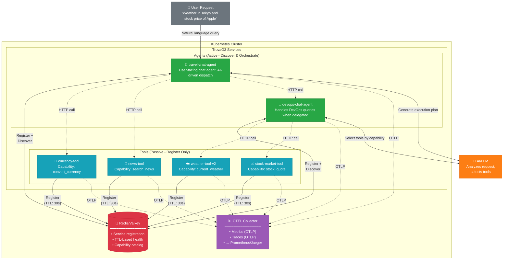
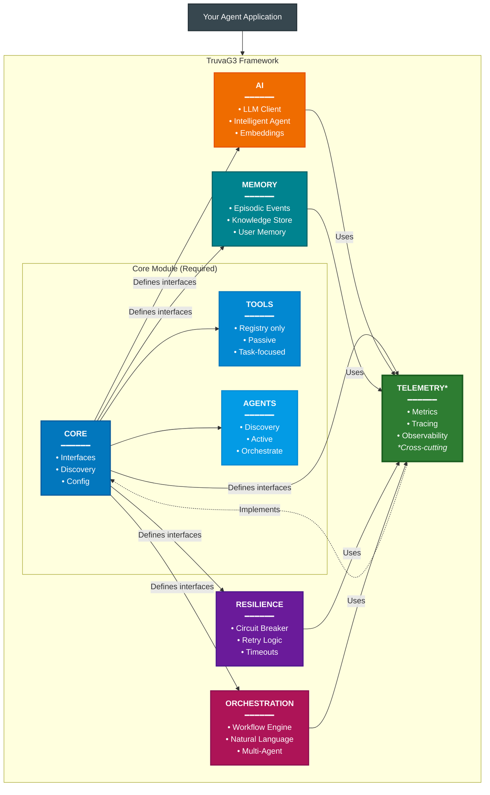

# TruvaG3 — A Microagents Framework

[](https://golang.org/dl/)
[](LICENSE)

> **A different way to wire agents and tools.** Specialized agents and tools register their capabilities with a shared registry, find each other by logical name at runtime, and coordinate without a central conductor — the microservices pattern, applied to multi-agent systems.

> **About this framework.** TruvaG3 is the open-source reference implementation of the microagents architecture described in [A Microagents Reference Architecture: Dynamic Capability Discovery and Decentralized Coordination](www/blogs/microagents-architecture.html). The framework demonstrates the architecture in working code — and adds the operational features a multi-agent system tends to need on top: a vendor-agnostic AI client, DAG-based execution with iterative re-plan, circuit breakers and semantic retry, OpenTelemetry instrumentation, two-tier memory, and human-in-the-loop approvals. Every backend (service discovery, LLM provider, telemetry, memory store) and most framework behaviors (prompt construction, planning, retry, pipeline hooks) sit behind interfaces that can be swapped.

The architecture has five defining properties, each implemented here:

1. **Specialized, independently deployable** — agents and tools run in their own processes, with their own release cadence and ownership.
2. **Runtime registration with a shared registry** — capabilities are advertised at runtime, not wired into a caller's source code.
3. **Capability-based addressing** — callers ask for `geocode_location` (a logical name); the framework resolves to whichever endpoint currently serves it.
4. **Independently scalable, replaceable, migratable** — callers continue to look participants up by the same name; the registry tracks where it currently points.
5. **Decentralized coordination** — each peer drives its own flow; the registry mediates discovery, not control.

Two coordination layers fall out of the design:

- **Inside each agent — orchestration.** One AIOrchestrator drives plan → execute → synthesize, returning to plan when fresh data unlocks the next phase. Plans are DAGs of capability invocations executed with parallelism where dependencies allow.
- **Between participants — decentralized coordination.** Each agent reads the shared registry, resolves capabilities to endpoints, and calls peers directly over HTTP/REST. No process in the middle routes, sequences, or coordinates.

**Vendor-agnostic by design**: integrates with OpenAI, Anthropic, Gemini, Groq, DeepSeek, or any OpenAI-compatible endpoint (including self-hosted models via Ollama, vLLM, llama.cpp). Switching providers does not require agent code changes.

**Distributed-systems patterns**: capability-based service discovery (Redis/Valkey by default; pluggable behind `core.Discovery`), resilience primitives (circuit breakers, semantic retry, panic recovery), and OpenTelemetry instrumentation with distributed tracing and unified metrics. Written in Go for a small runtime footprint (~15-44MB containers, ~6-45MB runtime memory) and direct use of Kubernetes primitives.

**Where this is most useful**: when the goal is not a single agent but a network of agents and tools that can be developed and operated independently, on infrastructure you already run. Self-hosted operation, namespace-oriented isolation, direct in-cluster service communication, and growth from a handful of participants to a large internal fleet — all without an external SaaS control plane.

## Table of Contents

**1. Quick Start**
- [Why TruvaG3?](#why-truvag3-microservices-architecture-for-ai-agents) • *2 min read*
- [Getting Started in 5 Minutes](#getting-started-in-5-minutes) • *5 min setup*

**2. Core Concepts**
- [What Makes TruvaG3 Unique](#what-makes-truvag3-unique-dynamic-agent-discovery-vendor-agnostic-microservice-native-ai) • *Key differentiators*
- [Architecture Overview](#how-truvag3-works) • *5 min read*
- [Deployment Model](#25-deployment-model-agents-run-as-ordinary-kubernetes-workloads) • *Agents as ordinary K8s workloads*

**3. Documentation**
- [Module Documentation](#module-documentation) • *Per-module READMEs*
- [Guides](#guides) • *In-depth topics*
- [References](#references) • *API surface and runtime config*

**4. Resources**
- [Examples Repository](#examples) • *Working code*
- [Next Steps](#next-steps) • *Where to go from here*
- [Contributing](#contributing) • *Join the project*

---

**Reading Paths:**
- **Quick Evaluation** (3 mins): Top of README — architecture summary and five properties
- **Developer Onboarding** (15 mins): Getting Started → Examples
- **Architecture Review** (30 mins): Architecture Overview → Examples
- **Complete Guide** (60 mins): Read everything top to bottom

---

## Why TruvaG3? Microservices Architecture for AI Agents

### 1. The Microservices Paradigm Applied to AI

**The Core Insight**: The same principles that revolutionized web services—independent deployment, service discovery, fault isolation, and horizontal scaling—apply perfectly to AI agent systems.

Just as microservices decomposed monolithic applications into specialized, independently deployable services, TruvaG3 decomposes AI systems into:

- **Tools as Domain Services**: Each tool is an independent microservice focused on a specific domain, exposing multiple related capabilities. A stock-market-tool provides quotes, company profiles, and news; a weather-tool provides current conditions and forecasts. Deploy, scale, and update each domain independently.
- **Agents as Composable Orchestrators**: Agents discover and coordinate tools at runtime—but they also expose their own capabilities. A travel-research agent orchestrates weather, currency, and geocoding tools, then exposes `research_destination` as a capability that other agents can call. This enables hierarchical composition: agents calling agents.
- **Dynamic Discovery**: Both tools and agents register their capabilities; any agent can discover and use them. Add new tools or agents without redeploying existing ones.
- **Fault Isolation**: One tool failing doesn't crash your AI system. Circuit breakers prevent cascade failures.
- **Independent Scaling**: Scale only the tools under load. A popular weather tool can run 10 replicas while a rarely-used calculator runs one.
- **Zero-Downtime Updates**: Rolling deployments for individual tools. Agents discover new versions as they come online.

### 2. Kubernetes-Native: Built on Primitives You Already Operate

**Why reinvent the wheel?** Kubernetes already solved the hard problems of running microservices at scale. TruvaG3 builds on that foundation, adding AI-specific capabilities on top:

| Capability | Kubernetes Provides | TruvaG3 Adds |
|------------|---------------------|-------------|
| **Discovery** | Service DNS for static endpoints | Dynamic capability discovery (Redis/Valkey by default; pluggable) — agents find tools by what they do, not where they are |
| **Auto-scaling** | HPA scales pods based on metrics | Go's small memory footprint (typically 6-45MB per component) can increase pod density compared with heavier interpreter-based stacks |
| **Health Monitoring** | Restart failed pods | Circuit breakers prevent cascade failures before pods need restarting |
| **Load Balancing** | Distribute traffic across replicas | Intelligent routing based on tool capabilities and health status |
| **Rolling Updates** | Zero-downtime deployments | Agents automatically discover new tool versions as they come online |

Go's small containers (~15-44MB) and runtime footprint (~6-45MB) keep horizontal scaling cheap — adding replicas doesn't change the infrastructure cost much.

### 2.5 Deployment Model: Agents Run as Ordinary Kubernetes Workloads

Some deployments are constrained from running a separate hosted agent control plane — regulatory boundaries, air-gapped networks, or simply a preference for keeping agent systems inside an operational model the platform team already trusts.

TruvaG3 is designed for that case:

- **Self-hosted by default**: agents, tools, discovery, traces, and runtime data stay in your environment
- **Air-gapped friendly**: works in restricted environments where external SaaS dependencies are not acceptable
- **Namespace-oriented isolation**: teams, departments, and business domains can run separate agent ecosystems with clear boundaries
- **Direct use of Kubernetes primitives**: Deployments, Services, Ingress, NetworkPolicy, Secrets, autoscaling, and standard cluster observability all fit naturally
- **Platform-team friendly**: no need to replace your existing Kubernetes operating model to run agent workloads

This makes TruvaG3 well-suited to deployments that include:

- multiple internal agent programs in parallel
- different compliance zones or data boundaries
- separate non-prod and prod agent environments
- gradual growth from experiments to hundreds of agents and tools

### 3. Why Go? Language Is No Longer a Barrier

**The AI-Assisted Coding Revolution**: With GitHub Copilot, Claude Code, and Cursor, programming language syntax is no longer a barrier. If you understand programming concepts, AI assistants help you write idiomatic code in any language.

**So Why Choose Go for AI Tools and Agents?**

| What You Get with Go | The Reality |
|---------------------|-------------|
| **Container Size** | ~15-26MB for tools, ~24-44MB for agents |
| **Memory Footprint** | 6-45MB at runtime |
| **Startup Time** | ~100ms |
| **Deployment** | Single binary - no dependencies |
| **Concurrency** | Native goroutines - thousands of concurrent operations |
| **Kubernetes Native** | Built-in health checks, Service DNS support |

With AI assistance removing the language-learning curve, Go is a reasonable choice for agent infrastructure: agents end up faster to start, smaller in image size, and easier to operate as ordinary Kubernetes workloads.

## What Makes TruvaG3 Unique: Dynamic Agent Discovery, Vendor-Agnostic, Microservice-Native AI

While many popular frameworks center orchestration around explicit graphs, predefined roles, or conversation patterns, TruvaG3 takes a different approach: **dynamic capability-based discovery** where agents discover tools and other agents at runtime through a pluggable service registry (Redis/Valkey by default) — combined with **vendor-agnostic AI** that works with any LLM provider.

For architects, the practical differentiators are:

- **Agents and tools are ordinary services**: independently deployable, observable, and owned like any other platform workload
- **Discovery is capability-based, not just endpoint-based**: agents find what other services can do, not only where they are
- **Namespace isolation works with the architecture**: teams can run their own agent/tool ecosystems without flattening everything into one global control plane
- **No mandatory SaaS dependency**: a major advantage for regulated, internal, or air-gapped deployments
- **Direct service-to-service runtime**: once discovered, agents and tools communicate through normal in-cluster HTTP, which is easy for engineers and ops teams to reason about
- **Security aligns with existing K8s REST service models**: because agents and tools are ordinary HTTP services, teams that already secure REST microservices in Kubernetes can reuse the same ingress, gateway, mesh, mTLS, OAuth/JWT, header propagation, and network policy patterns instead of adopting a separate agent-specific security stack
- **Observability fits existing OTEL and Kubernetes operations**: TruvaG3 emits OpenTelemetry-native traces and metrics, carries trace context across agents and tools, and produces structured logs that are collected and correlated through the OTEL Collector and Loki/Jaeger stack, so platform teams can troubleshoot distributed agent workflows using the same Grafana, Jaeger, Prometheus, and collector patterns they already know
- **Well aligned with existing platform controls**: Kubernetes networking, rollout strategies, service DNS, logs, traces, metrics, and secrets management all remain first-class

### Dynamic Orchestration Over Predefined Workflows

**Many Frameworks Commonly Emphasize:**
- Workflows defined in code: chains, graphs, crews, or conversation patterns
- Agent roles and responsibilities that are often modeled explicitly
- More upfront orchestration structure when adding new capabilities
- Tool selection that is commonly declared in code or configuration

**TruvaG3's Approach:**
- AI generates execution plans at runtime based on natural language requests
- Tools register themselves with capabilities - no predefined roles needed
- New tools automatically become available to existing orchestrators via the service registry
- LLM dynamically selects tools based on discovered capabilities, not hardcoded references

### True Vendor Independence

Switch LLM providers without changing your agent code:

```go
// Same agent code works with any provider
client, _ := ai.NewClient(ai.WithProviderAlias("openai")) // or omit options and rely on env auto-detection

// Or explicitly choose providers at runtime
openai, _ := ai.NewClient(ai.WithProviderAlias("openai"))
anthropic, _ := ai.NewClient(ai.WithProviderAlias("anthropic"))
selfHosted, _ := ai.NewClient(ai.WithProviderAlias("openai.ollama")) // Your own models
```

Supported providers: OpenAI, Anthropic Claude, Google Gemini, AWS Bedrock, Groq, DeepSeek, xAI Grok, Qwen, Mistral, Together AI, Ollama, vLLM, llama.cpp, and any OpenAI-compatible endpoint. See [ai/README.md](ai/README.md#10-supported-providers) for the full list and auto-detection priorities.

### Compile-Time Enforcement of the Tool/Agent Boundary

TruvaG3 enforces architectural boundaries at compile time through Go interfaces:

```go
// Tools can ONLY register themselves (passive components)
type Registry interface {
    Register(ctx context.Context, info *ServiceInfo) error
    UpdateHealth(ctx context.Context, id string, status HealthStatus) error
    Unregister(ctx context.Context, id string) error
    // No discovery methods - tools cannot find other components
}

// Agents can BOTH register AND discover (active orchestrators)
type Discovery interface {
    Registry  // Embeds registration capability
    Discover(ctx context.Context, filter DiscoveryFilter) ([]*ServiceInfo, error)
    FindService(ctx context.Context, serviceName string) ([]*ServiceInfo, error)
    FindByCapability(ctx context.Context, capability string) ([]*ServiceInfo, error)
}
```

This isn't just a convention - it's enforced by the type system. Tools literally cannot access discovery methods, preventing architectural violations before your code even runs.

### Patterns from Distributed Systems Practice

TruvaG3 implements patterns familiar from distributed systems — service discovery, circuit breakers, structured retry, OpenTelemetry instrumentation — giving you a working reference to study and adapt:

| Aspect | TruvaG3 | Traditional Frameworks |
|--------|--------|----------------------|
| **Container Size** | 15-44MB | Depends heavily on base image and dependencies |
| **Memory per Component** | 6-45MB | Varies with runtime, libraries, and workload |
| **Startup Time** | ~100ms | Usually slower with interpreter and dependency initialization |
| **Concurrent Agents** | 1000s (goroutines) | Depends on runtime model and deployment architecture |
| **Health Checks** | Built-in from start | Added via extensions |
| **Circuit Breakers** | Native support | External libraries needed |
| **Service Discovery** | Capability-based, pluggable (Redis/Valkey by default) | Manual configuration |
| **Distributed Tracing** | OTel-native, W3C TraceContext propagation across agents and tools | Add instrumentation libraries per service |
| **OpenAPI Generation** | Auto-generated from registered capabilities | Hand-maintained specs |
| **Semantic Retry** | LLM computes corrected params | Manual error handling |
| **OAuth / Header Propagation** | Bearer + custom headers propagated through tool calls; runtime token refresh | Custom plumbing per service |
| **Async / Scheduled Execution** | Built-in async tasks (HTTP 202 + polling) and cron / one-shot scheduling | External job queue or workflow engine |

### Real-World Example: The Power of Autonomous Discovery

Consider building a multi-agent system. Here's how the approaches differ:

**LangGraph** ([Graph API docs](https://docs.langchain.com/oss/python/langgraph/use-graph-api)) - often models workflow control with explicit nodes and edges:
```python
from langgraph.graph import StateGraph, START, END

# A typical LangGraph workflow defines control flow explicitly
builder = StateGraph(GraphState)
builder.add_node("data_fetcher", fetch_data)
builder.add_node("analyzer", analyze_data)
builder.add_node("reporter", generate_report)
builder.add_edge(START, "data_fetcher")
builder.add_edge("data_fetcher", "analyzer")
builder.add_edge("analyzer", "reporter")
builder.add_edge("reporter", END)
graph = builder.compile()
```

**CrewAI** ([agent docs](https://docs.crewai.com/en/concepts/agents), [task docs](https://docs.crewai.com/en/concepts/tasks), [crew docs](https://docs.crewai.com/en/concepts/crews)) - commonly models collaboration through explicit roles, tasks, and crews:
```python
from crewai import Agent, Task, Crew

# A typical CrewAI crew defines agent roles and task ownership upfront
fetcher = Agent(role="Data Fetcher", goal="Fetch data from sources", backstory="...")
analyzer = Agent(role="Data Analyst", goal="Analyze the fetched data", backstory="...")
reporter = Agent(role="Reporter", goal="Generate reports", backstory="...")

# Tasks are commonly assigned explicitly to agents
task1 = Task(
    description="Fetch data",
    expected_output="Raw data from the configured sources",
    agent=fetcher,
)
task2 = Task(
    description="Analyze data",
    expected_output="Analysis summary with key findings",
    agent=analyzer,
    context=[task1],
)
task3 = Task(
    description="Generate report",
    expected_output="Final report based on the analysis",
    agent=reporter,
    context=[task2],
)

crew = Crew(agents=[fetcher, analyzer, reporter], tasks=[task1, task2, task3])
```

**AutoGen** ([SelectorGroupChat docs](https://microsoft.github.io/autogen/stable/user-guide/agentchat-user-guide/selector-group-chat.html), [teams docs](https://microsoft.github.io/autogen/stable/user-guide/agentchat-user-guide/tutorial/teams.html)) - commonly models collaboration through explicit participants and conversation/team patterns:
```python
from autogen_agentchat.agents import AssistantAgent
from autogen_agentchat.teams import SelectorGroupChat
from autogen_ext.models.openai import OpenAIChatCompletionClient

# A typical AutoGen setup creates participants and a team manager
model_client = OpenAIChatCompletionClient(model="gpt-4o")
planner = AssistantAgent("planner", model_client=model_client, description="Plan the work")
researcher = AssistantAgent("researcher", model_client=model_client, description="Gather information")
writer = AssistantAgent("writer", model_client=model_client, description="Produce the final answer")

team = SelectorGroupChat(
    [planner, researcher, writer],
    model_client=model_client,
)
result = await team.run(task="Analyze the data")
```

**TruvaG3 Approach (AI-Driven Orchestration):**
```go
// Create orchestrator - no explicit tool/agent wiring needed
orchestrator := orchestration.CreateOrchestrator(config, deps)

// Process natural language request
response, _ := orchestrator.ProcessRequest(ctx,
    "What's the weather in Tokyo and convert 1000 USD to JPY?", nil)

// The orchestrator automatically:
//   1. Discovers available TruvaG3 Tools from Redis (weather-tool-v2, currency-tool, etc.)
//   2. AI generates a DAG execution plan based on the request
//   3. Executes steps in parallel/sequential order as needed
//   4. Synthesizes results into a coherent response
```

In TruvaG3's dynamic mode, the deployed service is the source of truth for its capabilities: it registers with the shared discovery backend, keeps that registration fresh with a TTL, and can be resolved by any orchestrator searching for that capability. Other frameworks can load or filter callable tools dynamically, especially via MCP, but TruvaG3 makes capability discovery across independently deployed microagents and tool services a first-class runtime primitive.

## How TruvaG3 Works

### System Architecture - Runtime Behavior in Kubernetes

TruvaG3 is designed for distributed agent systems. Here's how Tools, Agents, and the Registry interact at runtime:



**Key Architectural Rules**:

| Component | Can Register | Can Discover | Role |
|-----------|-------------|--------------|------|
| **Tools** | ✅ Yes | ❌ No | Passive - do ONE thing well, respond to requests |
| **Agents** | ✅ Yes | ✅ Yes | Active - discover tools, orchestrate workflows, use AI |

**Understanding Tools and Agents**:

- **Tools** are like Unix commands (`ls`, `grep`, `sort`) or kitchen appliances - each does ONE thing well. A weather-tool fetches weather, a stock-tool fetches stock prices. Tools are "passive" within TruvaG3 (can't discover other components), but actively call APIs outside the TruvaG3 ecosystem to fulfill their capability - whether that's a public internet API (OpenWeatherMap), an internal service in your cluster (company-data-api), or a database.

- **Agents** are like chefs who use multiple kitchen tools to create a meal. They discover available tools, select the right ones for the task, and orchestrate complex workflows - often using AI to make intelligent decisions. Agents also register their own capabilities and can be discovered by other agents, enabling agent-to-agent composition (e.g., one agent delegating to another agent's published capability).

> **A note on terminology**: TruvaG3 "Tools" are **not** the same unit as "tools" in many agent frameworks. In LangChain/LangGraph, CrewAI, AutoGen, and MCP, a **tool** is usually a callable function or remote function schema exposed to an agent. A TruvaG3 **Tool** is an independent microservice — it runs in its own container, registers itself with the framework's pluggable service registry, and exposes one or more **capabilities** over HTTP. The cleaner mapping is: a TruvaG3 Tool plays the role of a tool-hosting service or MCP server, and a TruvaG3 capability plays the role of an MCP/LangChain/CrewAI/AutoGen tool.

> 📖 For detailed examples and patterns, see the [Core Module README](core/README.md#real-world-tool-examples).

**How It Works**:

1. **Tools Register** → Each tool announces itself to the service registry with capabilities and a 30-second TTL
2. **Heartbeat** → Tools refresh their TTL every 15 seconds (automatic via Framework)
3. **Agents Discover** → Agents query the service registry to find tools by capability (e.g., "find all tools with `current_weather`")
4. **AI Selects** → When processing natural language, AI analyzes available capabilities and generates an execution plan
5. **Coordinate** → Agent calls selected tools via HTTP, collects responses, synthesizes results

**This separation is enforced at compile-time** - Tools literally cannot access discovery methods, preventing architectural violations.

**Why Kubernetes Makes This Powerful**:

TruvaG3 leverages Kubernetes capabilities directly:

| Kubernetes Feature | How TruvaG3 Uses It |
|-------------------|-------------------|
| **Service DNS** | Tools register with K8s Service DNS (`weather-tool-v2-service.namespace.svc.cluster.local`), not pod IPs |
| **Load Balancing** | K8s Services automatically distribute traffic across all healthy pods |
| **Autoscaling** | HPA can scale pods 1→N without changing Redis/Valkey registration - same service DNS |
| **Pod Lifecycle** | Pod restarts, crashes, rolling updates don't affect discovery - K8s handles routing |
| **Health Checks** | Unhealthy pods removed from Service endpoints automatically via readinessProbe |

```yaml
# Example: weather-tool-v2 deployment (2 replicas, single service)
env:
  - name: TRUVAG3_K8S_SERVICE_NAME
    value: "weather-tool-v2-service"    # ← Registered in Redis/Valkey
  - name: TRUVAG3_K8S_SERVICE_PORT
    value: "80"                          # ← Service port, not container port
---
apiVersion: v1
kind: Service
metadata:
  name: weather-tool-v2-service          # ← This DNS is what agents discover
spec:
  type: ClusterIP
  ports:
  - port: 80
    targetPort: 8096                     # ← Maps to container port
  selector:
    app: weather-tool-v2                 # ← Routes to ALL matching pods
```

Replicas scale without code changes: the registry holds the Service DNS, not pod IPs, and Kubernetes distributes load across endpoints.

**For Ops Engineers & System Architects: Standard HTTP/REST throughout**

TruvaG3 uses **standard HTTP/REST** for all communication - no proprietary protocols, no magic:

| Your Existing Tool | TruvaG3 Compatibility |
|-------------------|---------------------|
| **API Gateway** (Kong, Ambassador, Nginx) | Route external traffic to agents - they're just HTTP services |
| **Service Mesh** (Istio, Linkerd) | mTLS, traffic shaping, canary deployments work automatically - no sidecar conflicts |
| **Ingress Controllers** | Standard K8s Ingress rules apply - expose agents like any other service |
| **Network Policies** | Restrict agent↔tool communication with standard K8s NetworkPolicy |

**Why this matters**:
- **No custom CRDs** - Uses standard Deployments, Services, ConfigMaps
- **No sidecar injection issues** - Plain HTTP, works with or without service mesh
- **Standard health endpoints** - `/health`, `/api/capabilities` work with any monitoring system

**Native OpenTelemetry Observability**:

TruvaG3 emits metrics and traces using the **OTLP protocol** - the industry-standard OpenTelemetry wire format. This means your observability data flows directly into your existing stack without adapters or format conversions:

| Category | Supported Tools |
|----------|----------------|
| **Open Source** | Prometheus, Jaeger, Grafana, Zipkin, Tempo |
| **Commercial** | Datadog, New Relic, Splunk, Dynatrace, Grafana Cloud, Honeycomb |

What you get out of the box:
- **Distributed traces** across agent→tool calls with W3C trace context propagation
- **Metrics** for request latency, discovery operations, AI token usage, circuit breaker state
- **Structured log correlation** - JSON logs carry request/trace context and are collected through the OTEL Collector into Loki/Jaeger workflows
- **Auto-instrumentation** - Framework handles span creation and metric recording automatically
- **Zero-config export** - Set `OTEL_EXPORTER_OTLP_ENDPOINT` and telemetry flows to your backend

---

### Module Architecture - Code-Level Design

TruvaG3's architecture enforces a clear separation between Tools (passive components) and Agents (active orchestrators), built on independent, composable modules. Start with just the core module and add only what you need - no forced dependencies, no bloat.



**Architectural Principles**:

- **Tool/Agent Separation (Enforced at Compile Time)**:
  - **Tools**: Can only register themselves (`Registry` interface) - they're passive components that respond to requests
  - **Agents**: Have discovery powers (`Discovery` interface) - they actively find and orchestrate both tools and other agents
  - This separation ensures clean architecture and prevents tools from creating complex dependencies

- **Core Module (Required)**: Foundation layer that defines:
  - All interfaces (`Component`, `Registry`, `Discovery`, `Telemetry`, `AIClient`, etc.)
  - Base implementations for Tools and Agents
  - Configuration management and service discovery

- **Module Dependencies**:
  - **AI, Memory, Resilience, Orchestration** → Core + Telemetry (for metrics and tracing)
  - **Telemetry** → Core (implements the `core.Telemetry` interface)
  - No circular dependencies - proper DAG structure

- **Telemetry as Cross-Cutting Concern**:
  - Core defines the `Telemetry` interface
  - Components receive telemetry via dependency injection
  - AI/Memory/Resilience/Orchestration import telemetry for metrics and distributed tracing
  - Follows Dependency Inversion Principle - depend on abstractions, not implementations

- **Clean Separation**: Each module has a single responsibility
- **Interface-Based Design**: All module interactions through well-defined interfaces
- **Incremental Complexity**: Start simple with Core, add modules as your needs grow

### Pick What You Need

```go
import (
    "github.com/truvaagents/truva-g3/core"          // Base agent (always needed)
    "github.com/truvaagents/truva-g3/ai"            // Add if you need LLM integration
    "github.com/truvaagents/truva-g3/memory"        // Add for cross-agent shared memory
    "github.com/truvaagents/truva-g3/orchestration" // Add for multi-agent coordination
    "github.com/truvaagents/truva-g3/resilience"    // Add for circuit breakers
    "github.com/truvaagents/truva-g3/telemetry"     // Add for metrics
)
```

Start simple with just `core`, add modules as you grow. No bloat, no unused features.

## Getting Started in 5 Minutes

See [GETTING_STARTED.md](GETTING_STARTED.md) for the full walkthrough — Kind cluster setup, deploying the bundled tools, configuring an AI provider, and the complete chat-UI flow. The [examples/](examples/) directory contains working tool and agent implementations referenced throughout that guide.

## Documentation

### Module Documentation

Each framework module ships with its own README covering interfaces, usage patterns, and module-specific extension points.

- [Core](core/README.md) — base components, framework lifecycle, discovery, capability registration
- [AI](ai/README.md) — multi-provider LLM clients, provider/model aliases, chain-client failover, embeddings
- [Orchestration](orchestration/README.md) — DAG planning, execution, streaming, HITL, workflow modes
- [Memory](memory/README.md) — shared agent memory and per-user memory backends
- [Resilience](resilience/README.md) — circuit breakers, retry with backoff, panic recovery
- [Telemetry](telemetry/README.md) — OpenTelemetry metrics, distributed tracing, structured logging

### Guides

**Architecture deep-dives:**
- [A Microagents Reference Architecture](www/blogs/microagents-architecture.html) — the reference-architecture article this framework implements
- [Introduction to TruvaG3](www/blogs/truvag3-introduction.html) — framework overview

**Building:**
- [Tool Development Guide](docs/building/TOOL_DEVELOPMENT_GUIDE.md) — building a Tool from scratch
- [Agent Development Guide](docs/building/AGENT_DEVELOPMENT_GUIDE.md) — building an Agent
- [AI Providers Setup Guide](docs/building/AI_PROVIDERS_SETUP_GUIDE.md) — provider aliases, model aliases, env-based configuration
- [Effective Prompts Guide](docs/building/EFFECTIVE_PROMPTS_GUIDE.md) — capability descriptions and prompt quality
- [Tool Schema Discovery Guide](docs/building/TOOL_SCHEMA_DISCOVERY_GUIDE.md) — three-phase payload generation
- [Adding Context to Your Agent](docs/building/ADDING_CONTEXT_TO_YOUR_AGENT_GUIDE.md) — pipeline hooks, RAG, guardrails

**Orchestration:**
- [Orchestration Modes Guide](docs/orchestration/ORCHESTRATION_MODES_GUIDE.md) — dynamic, predefined, and custom modes
- [LLM Planning Prompt Guide](docs/orchestration/LLM_PLANNING_PROMPT_GUIDE.md) — prompt customization
- [Error Handling Guide](docs/orchestration/ERROR_HANDLING_GUIDE.md) — structured errors, retry layers, recovery
- [Async Orchestration Guide](docs/orchestration/ASYNC_ORCHESTRATION_GUIDE.md) — HTTP 202 + polling pattern
- [Scheduled Tasks Guide](docs/orchestration/SCHEDULED_TASKS_GUIDE.md) — one-shot, delayed, and cron scheduling
- [Human-in-the-Loop User Guide](docs/orchestration/HUMAN_IN_THE_LOOP_USER_GUIDE.md) — plan and step approval checkpoints

**Memory & Chat:**
- [Agent Memory User Guide](docs/memory-and-chat/AGENT_MEMORY_USER_GUIDE.md) — shared and per-user memory
- [Chat Agent Guide](docs/memory-and-chat/CHAT_AGENT_GUIDE.md) — chat agent reference pattern
- [Chat Session Management Guide](docs/memory-and-chat/CHAT_SESSION_MANAGEMENT_GUIDE.md) — Redis-backed session lifecycle
- [Conversation History Guide](docs/memory-and-chat/CONVERSATION_HISTORY_GUIDE.md) — prompt-safe multi-turn history

**Observability:**
- [Distributed Tracing Guide](docs/observability/DISTRIBUTED_TRACING_GUIDE.md) — OTel propagation and trace/log correlation
- [Logging Implementation Guide](docs/observability/LOGGING_IMPLEMENTATION_GUIDE.md) — logger interface and conventions

**Operations:**
- [Auto-Discovery Guide](docs/operations/AUTO_DISCOVERY_GUIDE.md) — registration, leases, multi-replica behavior
- [Developer Tools Guide](docs/operations/DEV_TOOLS_GUIDE.md) — Swagger UI and the Registry Viewer
- [OAuth Security Guide](docs/operations/OAUTH_SECURITY_GUIDE.md) — Bearer + header propagation, runtime token refresh

**Overview:**
- [Framework Features Guide](docs/overview/FRAMEWORK_FEATURES_GUIDE.md) — comprehensive feature map across the framework

### References

- [API Reference](docs/reference/API_REFERENCE.md) — full API surface across modules
- [Environment Variables Guide](docs/reference/ENVIRONMENT_VARIABLES_GUIDE.md) — runtime configuration reference
- [Limits Cheatsheet](docs/reference/LIMITS_CHEATSHEET.md) — runtime limits and tuning knobs
- [Kubernetes Deployment](docs/operations/KUBERNETES.md) — deploying TruvaG3 components to Kubernetes
- [Intelligent Error Handling](docs/orchestration/INTELLIGENT_ERROR_HANDLING.md) — LLM-assisted error analysis details
- [TruvaG3 Tools vs MCP Servers](docs/reference/TRUVAG3_TOOLS_VS_MCP_SERVERS.md) — terminology and integration mapping

## Examples

Inventory of bundled examples in this repository. For setup details, see [GETTING_STARTED.md](GETTING_STARTED.md).

### Pedagogical agents

Each builds on a shared baseline of `core` + `ai` + `telemetry` and incrementally adds one module or pattern.

| Example | What it adds |
|---|---|
| [agent-example](examples/agent-example/) | Baseline Agent using only the foundational modules — no orchestration, resilience, or memory. Demonstrates capability registration, service discovery, and AI-driven tool selection. |
| [agent-with-orchestration](examples/agent-with-orchestration/) | Adds the `orchestration` module. Demonstrates DAG-based predefined workflows and dynamic AI-powered orchestration from natural-language queries. |
| [agent-with-resilience](examples/agent-with-resilience/) | Adds the `resilience` module. Demonstrates circuit breakers, retries with exponential backoff, timeout management, and graceful degradation with partial results. |
| [agent-with-telemetry](examples/agent-with-telemetry/) | Goes deep on the `telemetry` module. Demonstrates metrics, distributed tracing, and multi-environment profiles. |
| [agent-with-async](examples/agent-with-async/) | Demonstrates the async task pattern (HTTP 202 + polling) layered on top of AI orchestration. |
| [agent-with-human-approval](examples/agent-with-human-approval/) | Demonstrates Human-in-the-Loop (HITL) approval checkpoints — both plan-level and step-level pauses for human review. |

### Full applications

Use the complete module set (`core` + `ai` + `telemetry` + `orchestration` + `memory`).

| Example | What it does |
|---|---|
| [travel-chat-agent](examples/travel-chat-agent/) | Streaming multi-tool travel chat agent with SSE responses. Featured as the outer trace in the architecture article. |
| [devops-chat-agent](examples/devops-chat-agent/) | Cross-domain DevOps chat agent invoked by travel-chat-agent. Featured as the inner trace in the architecture article. |
| [qa-agent](examples/qa-agent/) | Event-driven QA agent: explores websites, generates Playwright tests with AI, files JIRA tickets, sends Slack notifications. |
| [event-driven-agent](examples/event-driven-agent/) | Incident-response agent: receives Prometheus AlertManager webhooks, orchestrates autonomous investigation, uses HITL for critical write operations. |

### Tools

See the [examples/](examples/) directory for the full set of bundled Tools — domain APIs (weather, currency, geocoding, news, stock, country info, flight, hotel) and platform integrations (Slack, JIRA, Confluence, Playwright, Prometheus). Each is an independent service that registers its capabilities with the shared registry.

### Apps & UIs

| Example | What it does |
|---|---|
| [chat-ui](examples/chat-ui/) | Frontend chat UI for the agents. |
| [registry-viewer-app](examples/registry-viewer-app/) | Live runtime dashboard — registry contents, execution DAGs, HITL checkpoints, shared memory. |

### Infrastructure

| Example | What it does |
|---|---|
| [k8-deployment](examples/k8-deployment/) | Cluster manifests for the supporting stack: Redis/Valkey, OTel Collector, Prometheus, Jaeger, Grafana. |

## Next Steps

1. **Run it locally** → [GETTING_STARTED.md](GETTING_STARTED.md) — set up a kind cluster, deploy the bundled examples, and (in section 4) build your own components with the included scaffolds
2. **Read the architecture article** → [A Microagents Reference Architecture](www/blogs/microagents-architecture.html) — the design this framework implements
3. **Survey the framework's capabilities** → [Framework Features Guide](docs/overview/FRAMEWORK_FEATURES_GUIDE.md) — comprehensive feature map across modules

## Contributing

The author currently accepts contributions for bug fixes and documentation updates. See [CONTRIBUTING.md](CONTRIBUTING.md).

## License

Apache License 2.0 — see [LICENSE](LICENSE) and [NOTICE](NOTICE).

TruvaG3™ and TruvaAgents™ are trademarks of Neelabh Tripathi.
